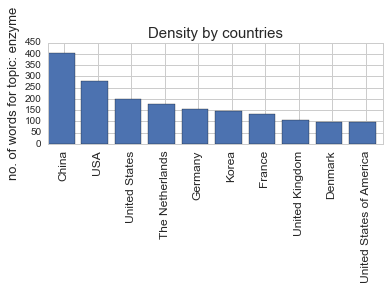
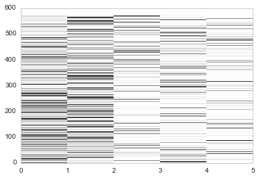
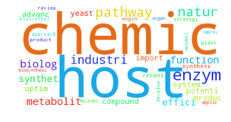
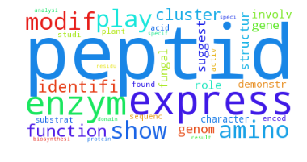

```python
import re
import lda
import operator
import numpy as np
import pandas as pd
import seaborn as sns
import itertools as it
import collections as c
import matplotlib.pyplot as plt

from wordcloud import WordCloud
from nltk.stem.porter import PorterStemmer

# Replace topic to analyze, ex. suicide, topic, enzyme etc.
topic = "enzyme"
# Replace place to search in, ex. AB: abstract, AD: address
search_in = "AB"
# Replace data file name, ex. protein_design.txt, synthetic_biology.txt
file_name = "Data/synthetic_biology.txt"

stopwords_file = 'Data/stopwords.txt'
thesauri_file = 'Data/country_thesauri.txt'

def main():
     # assessment 1 : parsing data
    record, corpus = get_record_corpus_from_file(file_name)
    topic_corpus = get_topic_corpus(corpus)

    all_words = c.Counter()
    stemmer = PorterStemmer()

    # assessment 2, 3 :reporting and analysis
    country_dict, collaboration_dict, counter_words_dict = get_country_collabo_counterwords_dicts(topic_corpus, all_words, stemmer)
    ten, words, labels = get_most_common_words_labels(country_dict)

    # assessment 4 : visualization
    plt = get_plot_of_density_by_country(words, labels)
    plt.show()

    doc_word, model, column_sum = get_column_sum_dt(counter_words_dict)
    plt2 = get_topic_cluster(plt, column_sum)
    plt2.show()
    
    # show heat map
    show_heat_map(model)
    
    # showing word cloud
    show_word_cloud(model, doc_word)

def show_heat_map(model):
    doc_model = model.doc_topic_
    heatmap = plt.pcolor(doc_model)
    plt.show()
    
def show_word_cloud(model, doc_word):
    topic_word = model.topic_word_
    n_top_words = 12
    word_array = np.array(doc_word.columns)
    for i, topic in enumerate(topic_word):
        topic_words = word_array[np.argsort(topic)][:-n_top_words:-1]

    n_top_words = 36
    wordcloudobj = WordCloud( background_color='white')

    for i, topic in enumerate(topic_word):
        topic_words = word_array[np.argsort(topic)][:-n_top_words:-1]
        word_cloud_string =' '.join(topic_words)
        wordcloud = wordcloudobj.generate(word_cloud_string)
        plt.imshow(wordcloud)
        plt.axis("off")
        plt.show()

def get_topic_cluster(plot, column_sum):
    sns.set_style('whitegrid')
    plt = plot
    fig = plt.figure()
    ax = fig.add_subplot(211)
    length = len(column_sum)
    ax.bar(np.arange(length), column_sum)
    ax.set_ylabel('no. documents per topic', fontsize=13)
    ax.set_xticklabels(['topic {}'.format(i) for i in range(length)], fontsize=12, rotation=90)
    ax.set_xticks(np.arange(length)+0.5)
    plt.title("Clusters by topic", fontsize=15)
    return plt

def get_column_sum_dt(counter_words):
    doc_word = pd.DataFrame.from_dict(counter_words, orient='index')
    doc_word.drop('allstopwords', axis=1, inplace=True)
    doc_word.fillna(0, inplace=True)
    doc_word = doc_word.astype(int)
    doc_count=doc_word.sum(axis='columns')
    doc_word = doc_word[doc_count != 0]

    model = lda.LDA(n_topics=5, n_iter=1000, random_state=1)
    model = model.fit(doc_word.values)
    column_sum = np.sum(model.doc_topic_, axis=0)
    return doc_word, model, column_sum

def get_plot_of_density_by_country(words, labels):
    %matplotlib inline

    sns.set_style('whitegrid')
    fig = plt.figure()
    ax = fig.add_subplot(211)
    ax.bar(np.arange(len(words)), words)
    ax.set_ylabel('no. of words for topic: ' + topic, fontsize=13)
    ax.set_xticklabels(labels, fontsize=12, rotation=90)
    ax.set_xticks(np.arange(len(labels))+0.5)
    plt.title("Density by countries", fontsize=15)
    return plt

def get_most_common_words_labels(country_dict):
    country_counter = c.Counter(country_dict)
    words = []
    labels = []
    ten = country_counter.most_common(10)

    for country in ten:
        words.append(country[1])
        labels.append(country[0])
    return ten, words, labels

def get_record_corpus_from_file(filepath):
    with open(filepath, 'r') as f:
        record = {}
        corpus = {}
        end_of_record = "SO  "
        unique_id = "PMID"

        for line in f:
            line = line.rstrip()
            tag = line[0:4]
            content = line[6:]

            if(tag == "    "):
                tag = lasttag
            lasttag = tag
            short_tag = tag.rstrip()

            if(len(content) > 0):
                if short_tag in record:
                    record[short_tag] = record[short_tag] + "; " + content
                else:
                    record[short_tag] = content

            if(tag == unique_id):
                record = {}
                article_id = content

            if(tag == end_of_record):
                corpus[article_id] = record

    f.close()
    return record, corpus

def get_topic_corpus(corpus):
    topicCorpus = {}

    for article_id in corpus:
        article = corpus[article_id]

        if ('PMID' in article):
            pmid = article['PMID']

            if (search_in in article):
                abst = article[search_in]
                abst = abst.lower()

                if (topic in abst):
                    topicCorpus[pmid] = article

    return topicCorpus


def get_country_collabo_counterwords_dicts(topic_corpus, all_words, stemmer):
    country_dict = {}
    collaboration_dict = {}
    counter_words_dict = {}

    for article_id in topic_corpus:
        article = topic_corpus[article_id]
        content = c.Counter()
        stopwordcount = 0

        if ('PMID' in article):
            pmid = article['PMID']

            if ('AD' in article):
                all_address = article['AD']
                all_address = re.sub('\; ',' ',all_address)
                all_address = remove_common_periods(all_address)
                all_address = remove_email_addresses(all_address)
                all_address = remove_area_codes(all_address)

                next_address = re.sub('\., ','; ',all_address)
                next_address = re.sub('\. ','; ',all_address)
                addressList = next_address.split("; ")
                countries = []

                for address in addressList:
                    address_part = address.split(",")
                    length = len(address_part)
                    country = address_part[length-1]
                    country = re.sub('^\s+','',country)
                    country = re.sub('\s+$','',country)
                    country = re.sub('\s+',' ',country)
                    country.rstrip()
                    country = use_thesauri(country, get_thesauri())

                    if (country != ''):
                        countries.append(country)

                        if (country not in country_dict):
                            country_dict[country]=1
                        else:
                            country_dict[country]+=1

                    collaboration_dict[pmid] = countries

            if search_in in article:
                abstract = article[search_in]
                depunct = re.sub('[;,\.]','',abstract)
                low = depunct.lower()
                words = low.split(" ")

                for word in words:
                    if word in get_stopwords():
                        stopwordcount += 1
                    else:
                        stem = stemmer.stem(word)
                        content[stem] += 1

            content['allstopwords'] = stopwordcount
            all_words+=content
            counter_words_dict[article_id]=content

    if country_dict:
        for key, value in country_dict.items():
            if 'POC' in key:
                key = 'Taiwan'
            if 'P R China' in key or 'Tianjin' in key or 'China' in key:
                key = 'China'
            if 'ROC' in key:
                key = 'South Korea'
            if 'India' in key:
                key = 'India'
            if (key not in country_dict):
                country_dict[key]=value
            else:
                country_dict[key]+=value

    return country_dict, collaboration_dict, counter_words_dict

def get_stopwords():
    stopwords =[]

    with open(stopwords_file, 'r') as f:
        for line in f:
            word=line.rstrip()
            stopwords.append(word)

        f.close()
    return stopwords

def get_thesauri():
    thesauri = {}

    with open(thesauri_file, 'r') as f:
        for line in f:
            line = line.strip()
            entry = line.split(",")
            key = entry[0]
            value = entry[1]
            thesauri[key]=value

        f.close()
    return thesauri

def remove_common_periods(string):
    string = re.sub(' N\.',' N',string)
    string = re.sub(' S\.',' S',string)
    string = re.sub(' E\.',' E',string)
    string = re.sub(' W\.',' W',string)
    string = re.sub('al\.','al',string)
    string = re.sub('Bldg\.','Bldg',string)
    string = re.sub('No\.','No',string)
    string = re.sub('Co\.','Co',string)
    string = re.sub('St\.','St',string)
    string = re.sub('Dr\.','Dr',string)
    string = re.sub('Dept\.','Dept',string)
    string = re.sub('Blvd\.','Blvd',string)
    string = re.sub('Sq\.','Sq',string)
    string = re.sub('Opp\.','Opp',string)
    string = re.sub('Av\.','Av',string)
    string = re.sub('n\.','n',string)
    string = re.sub('org\.','org',string)
    string = re.sub('Col\.','Col',string)
    string = re.sub('([A-Z])\.\s*','\g<1> ',string)

    return string

def remove_email_addresses(string):
    string = re.sub('Electronic address: ','',string)
    string = re.sub('e-mail:','',string)
    string = re.sub('([\w\<\.\-]+@[\w\.\>\-]+\s*)','',string)

    return string

def remove_area_codes(string):
    string = re.sub('([0-9]{2,}[-]*[0-9]*)','',string)
    string = re.sub('([A-Z]*[0-9]+[A-Z]*[\s]*[0-9]+[A-Z]*[0-9]{0,}\s*)','',string)
    string = string.strip()
    string = re.sub('\.$','',string)
    string = re.sub('[\s]+$','',string)
    string = re.sub('(-$)','',string)
    string = re.sub(' , ',', ',string)
    string = re.sub('[0-9]\.*','',string)

    return string

def use_thesauri(string, thesauri):

    if string in thesauri:
        string = thesauri[string]

    return string

if __name__ == '__main__':
    main()
```














```python

```
